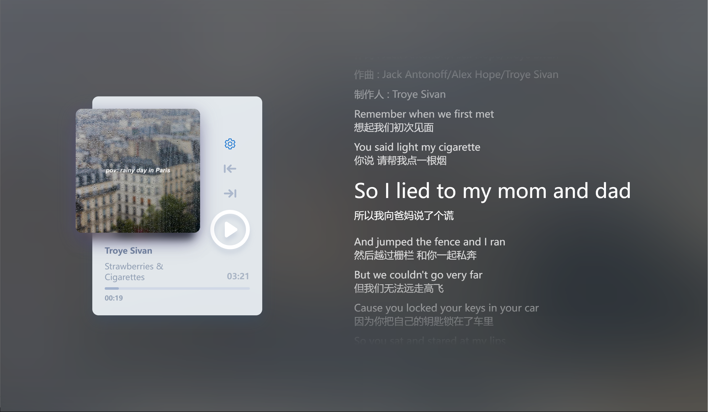

# 音乐播放器 / Music Player

一个使用Vue+Electron实现的音乐播放器。  
A music player implemented with Vue+Electron.

## 特性 / Features

- 支持本地音乐播放 / Support local music playback
- 支持在线音乐搜索与播放（版权风险自负） / Support online music search and playback
- 简洁美观的播放界面 / Minimal and beautiful playback interface
- 支持歌词显示与优雅滚动 / Support lyrics display with smooth scrolling
- 支持自动消除人声，调节人声比例 / Support vocal removal and voice ratio adjustment

## 安装与使用 / Setup

使用npm安装依赖：
Install dependencies with npm:

```bash
# require node.js 16.0
nvm install 16
nvm use 16
# or you need to adjust some dependencies in package.json
npm install
```

运行开发环境或打包 / Run development or build:

```bash
npm run electron:serve # development
npm run electron:build # production
```

## 截图 / Screenshots




## 注意 / Notice

本项目仅供学习交流使用，不得用于商业用途。  
This project is for educational and non-commercial purposes only.

## Credits

[NeteaseCloudMusicApi: https://www.npmjs.com/package/NeteaseCloudMusicApi](https://www.npmjs.com/package/NeteaseCloudMusicApi)

[mini-player: https://github.com/muhammed/mini-player](https://github.com/muhammed/mini-player)

[vocal-remover: https://github.com/tsurumeso/vocal-remover](https://github.com/tsurumeso/vocal-remover)